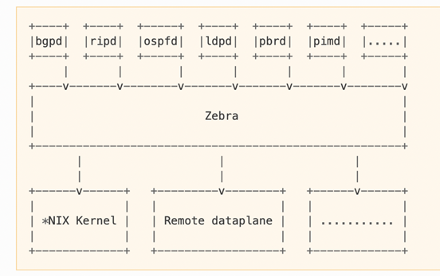

# FRRouting

`Free Range Routing` or `FRRouting` or `FRR` is a fully featured, high performance, free software IP routing suite written primarily in C. It implements all standard routing protocols such as distant-vector routing (RIP, EIGRP), link-state routing (OSPF, IS-IS), multicast routing (PIMS), BGP, LDP, MPLS, BFD and more. FRR runs on all modern *NIX operating systems, including Linux and the BSDs, and is distributed under GPLv2. You can check the feature matrix in [here](https://docs.frrouting.org/en/stable-10.2/about.html#feature-matrix). FRR git repository is in [here](https://github.com/FRRouting/frr).

FRR is widely used in network environments for its flexibility, performance, and support for a broad range of routing protocols. It is designed to be modular, allowing users to enable or disable specific routing protocols as needed. It integrates well with the Linux networking stack, leveraging its capabilities to provide efficient and scalable routing solutions.

FRR is maintained by a community of developers and is part of the Linux Foundation's networking projects. It has extensive documentation and active community support, making it accessible for both beginners and experienced network engineers. It is actively used in production by hundreds of companies, universities, research labs and governments.

FRR started as a fork of [Quagga](https://github.com/Quagga/quagga) in 2016 due to perceived stagnation in Quagga's development. Quagga is an open-source routing software that was a fork of the older Zebra project. It has been used widely for implementing network routing protocols in Unix-based systems. It supports essential routing protocols like BGP, OSPF, RIP, and IS-IS but lacks some of the newer features and improvements found in FRR.

## FRR System Architecture

FRR is a suite of daemons that work together to build the routing table. Each protocol is implemented in its own daemon, and these daemons talk to a middleman daemon (`zebra`), which is responsible for coordinating routing decisions and talking to the dataplane. Note that FRR is control plane software. It does not itself forward packets - it exchanges information with peers about how to forward packets. Forwarding plane performance largely depends on choice of NIC/ASIC.

An illustration of the large scale FRR architecture is given below.



This architecture allows for high resiliency, since an error, crash or exploit in one protocol daemon will generally not affect the others. It is also flexible and extensible since the modularity makes it easy to implement new protocols and tie them into the suite. Additionally, each daemon implements a plugin system allowing new functionality to be loaded at runtime.

All of the FRR daemons can be managed through a single integrated user interface shell called `vtysh`. vtysh connects to each daemon through a UNIX domain socket and then works as a proxy for user input. In addition to a unified frontend, vtysh also provides the ability to configure all the daemons using a single configuration file through the integrated configuration mode. This avoids the overhead of maintaining a separate configuration file for each daemon.

Moreover, `zebra` is the daemon that resolves the routes provided by multiple protocols (including the static routes you specify) and programs these routes in the Linux kernel using `netlink` (in Linux). The FRRouting documentation defines zebra as the IP routing manager for FRR that provides kernel routing table updates, interface lookups, and redistribution of routes between different routing protocols.

## FRR Installation

You can install FRR from [packages](https://deb.frrouting.org/) or install it directly from the [source](https://docs.frrouting.org/en/latest/installation.html#from-source).

Once the installation is finished, make sure the frr service is up and running:

```bash
systemctl status frr
```

The `watchfrr`, `zebra`, and `static` daemons are always running. The `watchfrr` is a daemon that monitors the health and status of the other FRR daemons. It is primary responsible for monitoring, restarting, and notification. The `static` daemon is responsible for managing static routes within the FRR suite. It interacts with `zebra` to ensure that the static routes are properly integrated with other dynamic routing protocols and the overall routing table.

Add your username into the frr group, and restart the system for the changes to take effect.

```bash
sudo usermod -a -G frr <username>
```

Open the FRR daemon file with the edior of your choice:

```bash
sudo nano /etc/frr/daemons
```

And enable/disable daemons. For example, you can enable OSPF daemon by setting `ospf=yes` in that file. Once you save the file, restart the frr service.

```bash
systemctl restart frr
```

`vtysh` is a CLI shell provided by FRR that allows network administrators to interact with multiple FRR daemons through a single, unified command interface. It is modeled after the CLI used in many enterprise-grade networking devices, making it familiar to network engineers.

```bash
sudo vtysh
```

Display the list of interfaces:

```bash
frr# show interface brief

Interface       Status  VRF          Addresses
---------       ------  ---          ---------
enp0s3          up      default      10.0.2.15/24
                                     fe80::b1b9:972d:5028:45cb/64
lo              up      default
```

Display the current routing table:

```bash
frr# show ip route

Codes: K - kernel route, C - connected, L - local, S - static,
       R - RIP, O - OSPF, I - IS-IS, B - BGP, E - EIGRP, N - NHRP,
       T - Table, v - VNC, V - VNC-Direct, A - Babel, F - PBR,
       f - OpenFabric, t - Table-Direct,
       > - selected route, * - FIB route, q - queued, r - rejected, b - backup
       t - trapped, o - offload failure

K>* 0.0.0.0/0 [0/100] via 10.0.2.2, enp0s3, 00:17:12
L>* 10.0.2.15/32 is directly connected, enp0s3, 00:17:12
K>* 169.254.0.0/16 [0/1000] is directly connected, enp0s3, 00:17:12
```
