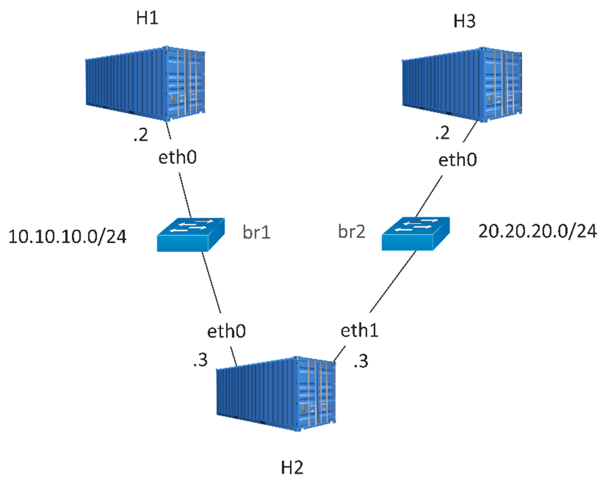

# VPP-LabNet

vpp-labnet is a containerized lab environment designed to explore and validate high-performance packet forwarding using Vector Packet Processing (VPP). The setup consists of three Docker containers, each running VPP to simulate a multi-node virtual network. To enable dynamic routing across the nodes, the lab integrates FRRouting (FRR), allowing the use of protocols such as OSPF or BGP for automated route exchange. This environment provides a lightweight and flexible platform for testing VPP-based forwarding, routing interoperability, and performance tuning in a reproducible and isolated setup.

The following guides provide an introduction to VPP and FRRouting:

- [VPP Introduction](VPP.md)
- [FRRouting](FRRouting.md)

## VPP Test Setup

We are going to create three Ubuntu 20.04 containers as shown below:




## VPP Graph

Display VPP graph:

```bash
vppctl# show vlib graph
```

`First column` is the name of the node.

`Second column` is the name of the children of that node.

`Third column` is the name of the parents of this node.

Save the output to a file, and invoke the script by:

```bash
graph.py --input <path/to/vpp/node/txt/file>
```
