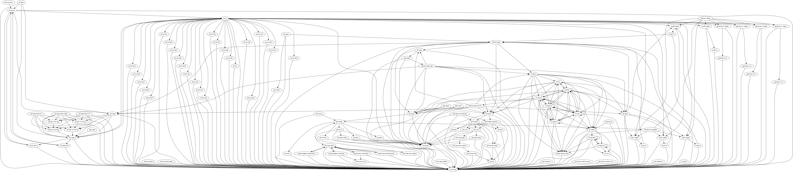

# VPP-LabNet

vpp-labnet is a containerized lab environment designed to explore and validate high-performance packet forwarding using Vector Packet Processing (VPP). The setup consists of three Docker containers, each running VPP to simulate a multi-node virtual network. To enable dynamic routing across the nodes, the lab integrates FRRouting (FRR), allowing the use of protocols such as OSPF or BGP for automated route exchange. This environment provides a lightweight and flexible platform for testing VPP-based forwarding, routing interoperability, and performance tuning in a reproducible and isolated setup.

The following guides provide an introduction to VPP and FRRouting:

- [VPP Introduction](VPP.md)
- [FRRouting](FRRouting.md)

## VPP Test Setup

We are going to create three Ubuntu 20.04 containers and install VPP on each.


Build the vpp-img:

```bash
docker build --tag vpp-img .
```

Start the containers:

```bash
docker compose up -d
```

Go to the H2 docker container:

```bash
docker exec -it H2 bash
```

From H2, you should be able to ping both H1 and H3 containers by name:

```bash
ping H1
ping H3
```

Note that H1 and H3 cannot see each other.

## Mapping Interfaces Inside VPP

Go to the H1 container:

```bash
docker exec -it H1 bash
```

Open a vppctrl shell:

```bash
vppctl
```

Create host interface eth0 in the VPP:

```bash
vpp# create host-interface name eth0
vpp# set interface state host-eth0 up
vpp# set interface ip address host-eth0 10.10.10.2/24
```

Go to the H3 container:

```bash
docker exec -it H3 bash
```

Open a vppctrl shell:

```bash
vppctl
```

Create host interface eth0 in the VPP:

```bash
vpp# create host-interface name eth0
vpp# set interface state host-eth0 up
vpp# set interface ip address host-eth0 20.20.20.2/24
```

Go to the H2 container:

```bash
docker exec -it H2 bash
```

Open a vppctrl shell:

```bash
vppctl
```

Create host interface eth0 and eth1 in the VPP:

```bash
vpp# create host-interface name eth0
vpp# set interface state host-eth0 up
vpp# set interface ip address host-eth0 10.10.10.3/24

vpp# create host-interface name eth1
vpp# set interface state host-eth1 up
vpp# set interface ip address host-eth1 20.20.20.3/24
```

## Adding Static Routes

Go to the H1 container:

```bash
docker exec -it H1 bash
```

Open a vppctrl shell:

```bash
vppctl
```

Try to ping H3:

```bash
vpp# ping 20.20.20.2

Failed: no egress interface
Failed: no egress interface
Failed: no egress interface
```

H1 cannot ping H3, because it does not know how to reach 20.20.20.0/24 subnet.

```bash
vpp# show ip fib 20.20.20.2

 forwarding:   unicast-ip4-chain
  [@0]: dpo-load-balance: [proto:ip4 index:1 buckets:1 uRPF:0 to:[0:0]]
    [0] [@0]: dpo-drop ip4  <----------
```

Add the following static route in H1:

```bash
vpp# ip route add 20.20.20.0/24 via 10.10.10.3
```

Go to H3 and add the following static route:

```bash
vpp# ip route add 10.10.10.0/24 via 20.20.20.3
```

Now, H1 can ping H3:

```bash
vpp# ping 20.20.20.2

116 bytes from 20.20.20.2: icmp_seq=1 ttl=64 time=7.8537 ms
116 bytes from 20.20.20.2: icmp_seq=2 ttl=64 time=11.0553 ms
116 bytes from 20.20.20.2: icmp_seq=3 ttl=64 time=4.0369 ms
```

Similarly, H3 can ping H1:

```bash
vpp# ping 10.10.10.2

116 bytes from 10.10.10.2: icmp_seq=1 ttl=63 time=8.2288 ms
116 bytes from 10.10.10.2: icmp_seq=2 ttl=63 time=12.2444 ms
116 bytes from 10.10.10.2: icmp_seq=3 ttl=63 time=13.2027 ms
```

## Setting up FRR

Instead of configuring static routes on the VPP hosts, we can implement dynamic routing protocols—such as OSPF—across all three containers using FRRouting (FRR).

Remove the configured static route from H1 container:

```bash
vpp# ip route del 20.20.20.0/24 via 10.10.10.3
```

Remove the configured static route from H3 container:

```bash
vpp# ip route add 10.10.10.0/24 via 20.20.20.3
```

Go to the H1 container:

```bash
docker exec -it H1 bash
```

Open the FRR daemons file and enable ospfd daemon by setting `ospfd=yes`:

```bash
nano /etc/frr/daemons
```

Restart the FRR daemon for the changes to take effect.

```bash
/usr/lib/frr/frrinit.sh restart
```

Go to the FRR CLI shell:

```bash
vtysh
```

And configure OSPF:

```bash
frr# conf t
frr(config)# interface lo
frr(config-if)# ip address 1.1.1.1/32
frr(config-if)# exit

frr(config)# router ospf
frr(config-router)# network 1.1.1.1/32 area 0
frr(config-router)# network 10.10.10.2/24 area 0
frr(config-router)# end
```

Go to the H3 container:

```bash
docker exec -it H3 bash
```

And enable ospfd daemon by setting `ospfd=yes`:

```bash
nano /etc/frr/daemons
```

Restart the FRR daemon for the changes to take effect.

```bash
/usr/lib/frr/frrinit.sh restart
```

Go to the FRR CLI shell:

```bash
vtysh
```

And configure OSPF:

```bash
frr# conf t
frr(config)# interface lo
frr(config-if)# ip address 3.3.3.3/32
frr(config-if)# exit

frr(config)# router ospf
frr(config-router)# network 3.3.3.3/32 area 0
frr(config-router)# network 20.20.20.2/24 area 0
frr(config-router)# end
```

Go to the H2 container:

```bash
docker exec -it H2 bash
```

And enable ospfd daemon by setting `ospfd=yes`:

```bash
nano /etc/frr/daemons
```

Restart the FRR daemon for the changes to take effect.

```bash
/usr/lib/frr/frrinit.sh restart
```

Go to the FRR CLI shell:

```bash
vtysh
```

And configure OSPF:

```bash
frr# conf t
frr(config)# interface lo
frr(config-if)# ip address 2.2.2.2/32
frr(config-if)# exit

frr(config)# router ospf
frr(config-router)# network 2.2.2.2/32 area 0
frr(config-router)# network 10.10.10.3/24 area 0
frr(config-router)# network 20.20.20.3/24 area 0
frr(config-router)# end
```

Once the routing tables across all containers are converged, you should be able to see OSPF neighbors.

```bash
frr# show ip ospf neighbor
```

The routing table on H1 looks like this:

```bash
frr# show ip route

Codes: K - kernel route, C - connected, L - local, S - static,
       R - RIP, O - OSPF, I - IS-IS, B - BGP, E - EIGRP, N - NHRP,
       T - Table, v - VNC, V - VNC-Direct, A - Babel, F - PBR,
       f - OpenFabric, t - Table-Direct,
       > - selected route, * - FIB route, q - queued, r - rejected, b - backup
       t - trapped, o - offload failure

IPv4 unicast VRF default:
K>* 0.0.0.0/0 [0/0] via 10.10.10.1, eth0, weight 1, 00:12:03
O   1.1.1.1/32 [110/0] is directly connected, lo, weight 1, 00:07:35
L * 1.1.1.1/32 is directly connected, lo, weight 1, 00:07:49
C>* 1.1.1.1/32 is directly connected, lo, weight 1, 00:07:49
O>* 2.2.2.2/32 [110/10] via 10.10.10.2, eth0, weight 1, 00:02:08
O>* 3.3.3.3/32 [110/20] via 10.10.10.2, eth0, weight 1, 00:02:03
O   10.10.10.0/24 [110/10] is directly connected, eth0, weight 1, 00:07:31
C>* 10.10.10.0/24 is directly connected, eth0, weight 1, 00:12:03
L>* 10.10.10.3/32 is directly connected, eth0, weight 1, 00:12:03
O>* 20.20.20.0/24 [110/20] via 10.10.10.2, eth0, weight 1, 00:02:08
```

You can check the kernel routes on H1:

```bash
# ip route

default via 10.10.10.1 dev eth0
2.2.2.2 nhid 10 via 10.10.10.2 dev eth0 proto ospf metric 20
3.3.3.3 nhid 10 via 10.10.10.2 dev eth0 proto ospf metric 20
10.10.10.0/24 dev eth0 proto kernel scope link src 10.10.10.3
20.20.20.0/24 nhid 10 via 10.10.10.2 dev eth0 proto ospf metric 20
```

H1 and H3 should be able to ping each other.

## VPP Graph

Display VPP graph:

```bash
vppctl# show vlib graph
```

- `First column` is the name of the node.
- `Second column` is the name of the children of that node.
- `Third column` is the name of the parents of this node.

Save the output to a file, and invoke the python script by:

```bash
graph/graph.py --input <path/to/vpp/node/txt/file>
```

Here is a sample VPP graph. Yes, its huge!


